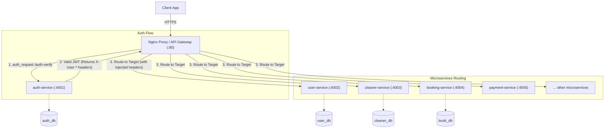

# CleanUp 🧼

> *Book trusted home cleaners in minutes.*

[](#)
[](#)
[](#)
[-2BA3EC)](#)

CleanUp is an Urban Company–inspired, client-oriented cleaning service marketplace that connects **clients** (people who book cleanings) with **cleaners** (service providers) and is managed by **admins**. The codebase is a **React Native** monorepo (running on the web first via React Native Web) wrapped in a **microservices backend**, all orchestrated with Docker Compose.

> ✨ Designed to feel like stepping into a freshly cleaned home — soft sky blues, fresh mints, generous whitespace, calm motion.

---

## Table of Contents
1. [Architecture](#architecture)
2. [Features by Role](#features-by-role)
3. [Microservices](#microservices)
4. [Tech Stack](#tech-stack)
5. [Quick Start](#quick-start)
6. [Environment Variables](#environment-variables)
7. [Project Layout](#project-layout)
8. [Design System](#design-system)
9. [Notifications & Admin Config](#notifications--admin-config)
10. [Roadmap](#roadmap)
11. [License](#license)

---

## Architecture

Every incoming request initially lands on the **Nginx Proxy** (API Gateway). The proxy is responsible for routing all traffic. For protected API routes, Nginx delegates authentication to the **auth-service** using the `auth_request` module. Only after the `auth-service` validates the token does Nginx route the request to the downstream microservices, injecting the verified user identity into the headers.



**Key principles**
- **Nginx Proxy is the single entry point**: All external requests hit Nginx first. It handles routing, rate-limiting, and serving the built frontend.
- **Centralized Authentication**: Nginx uses `auth_request` to force the `auth-service` to validate every request before it reaches other services. This ensures secure authorization checks cannot be bypassed.
- **One container per service** — true microservice isolation.
- **One MongoDB database per service** — no shared schemas, no cross-service joins.
- All inter-service calls are REST over the internal Docker network, falling back to local JWT checks if bypassing Nginx internally.

---

## Features by Role

### 👤 Admin
- Register and manage cleaners (admin-service → cleaner-service → auth-service → notification-service).
- View dashboards, bookings, revenue, cleaner utilisation (analytics-service).
- Configure **SMS / Push / Email / Payment providers, secrets, feature flags, pricing** (config-service).
- Manage client accounts, view audit log, override bookings (admin-service + booking-service).
- Handle support tickets, set SLAs, assign agents (support-service).

### 🧹 Cleaner
- Log in with **username + password** (auth-service).
- Toggle availability, set weekly schedule (cleaner-service).
- Receive job offers via **push + SMS**, accept or reject with a reason (notification-service, booking-service).
- Start / complete jobs, mark cash collected (booking-service → payment-service).
- Chat with client during the job (chat-service).
- View earnings history, ratings, payouts (booking-service, review-service, payment-service).
- Raise support tickets (support-service).

### 🏠 Client
- Self-register with **username + password** (auth-service).
- Set address(es) and language (user-service).
- Search services by pincode, see real-time availability (booking-service).
- Book in 4 steps: **Service → Schedule → Address → Review** (booking-service).
- Apply promo codes (promo-service) and earn loyalty points (loyalty-service).
- Reschedule or cancel upcoming bookings; request a specific cleaner (booking-service).
- **Pay cash** to cleaner on completion (payment-service).
- Rate and review cleaner (review-service).
- Chat with cleaner (chat-service).
- Raise support tickets (support-service).
- Receive notifications by SMS / push / email (notification-service).

---

## Microservices

| # | Service | Port | DB | Responsibility |
|---|---------|------|----|----------------|
| 1 | `auth-service` | 4001 | `auth_db` | Register, login, JWT issue/refresh, password reset |
| 2 | `user-service` | 4002 | `user_db` | Client profiles, addresses, preferences |
| 3 | `cleaner-service` | 4003 | `cleaner_db` | Cleaner profiles, skills, ratings, availability |
| 4 | `booking-service` | 4004 | `book_db` | Booking lifecycle, auto-assignment, rescheduling |
| 5 | `payment-service` | 4005 | `pay_db` | Cash ledger (MVP), gateway-agnostic interface |
| 6 | `notification-service` | 4006 | `notif_db` | SMS / push / email dispatch (reads `config-service`) |
| 7 | `admin-service` | 4007 | `adm_db` | Admin accounts, role permissions, audit log |
| 8 | `config-service` | 4008 | `cfg_db` | Runtime config: SMS keys, push keys, feature flags, prices |
| 9 | `support-service` | 4009 | `support_db` | Support tickets, SLA, escalation |
| 10 | `chat-service` | 4010 | `chat_db` | In-app chat between cleaner ↔ client (WebSocket) |
| 11 | `review-service` | 4011 | `review_db` | Ratings & reviews, moderation |
| 12 | `promo-service` | 4012 | `promo_db` | Promo codes, referral bonuses |
| 13 | `loyalty-service` | 4013 | `loyalty_db` | Loyalty points, tiers |
| 14 | `analytics-service` | 4014 | `analytics_db` | Aggregations for admin dashboards |
| 15 | `nginx-proxy` | 80/443 | — | API gateway, routing, rate limit, SSL, static frontend |
| 16 | `frontend` | 3000 (internal) | — | React Native Web build, served via Nginx |
| 17 | `mongo` | 27017 | — | All logical DBs in one container (init script) |

---

## Tech Stack

- **Frontend:** React Native (Web) via Expo, React Navigation, Zustand, Axios, i18next, Reanimated.
- **Backend:** Node.js 20, Express, Mongoose, Zod, Winston, JSON Web Tokens (RS256), ws (for chat).
- **Database:** MongoDB 7 (one logical DB per service).
- **Gateway:** Nginx 1.27.
- **Tooling:** Docker, Docker Compose, ESLint, Prettier, Vitest, supertest, Playwright (e2e), axe-core (a11y).

---

## Quick Start

```bash
# 1. Clone & enter
git clone <repo> cleanup && cd cleanup

# 2. Copy env
cp .env.example .env

# 3. Build & start
docker compose up -d --build

# 4. Seed the first admin + sample data
docker compose exec auth-service node scripts/seed.js

# 5. Open
open http://localhost
```

Default seeded credentials:

| Role   | Username         | Password     |
|--------|------------------|--------------|
| Admin  | `admin`          | `Admin@123`  |
| Cleaner| `cleaner_ramesh` | `Cleaner@123`|
| Client | `client_anu`     | `Client@123` |

> You'll be forced to change the admin password on first login.

---

## Environment Variables

See [`.env.example`](.env.example) for the full list. Highlights:

| Variable | Purpose | Default |
|----------|---------|---------|
| `MONGO_URI` | Mongo connection string | `mongodb://mongo:27017` |
| `JWT_ACCESS_TTL` | Access-token lifetime | `15m` |
| `JWT_REFRESH_TTL` | Refresh-token lifetime | `30d` |
| `JWT_PRIVATE_KEY` / `JWT_PUBLIC_KEY` | RS256 keys | generated by you |
| `CONFIG_ENC_KEY` | AES-256 key for secret config values | 32 random bytes |
| `DEFAULT_ADMIN_USERNAME` | Seeded admin username | `admin` |
| `DEFAULT_ADMIN_PASSWORD` | Seeded admin password | `Admin@123` |

**Production note:** SMS, push, and email provider keys (Twilio, FCM, SendGrid, etc.) are **not** environment variables — they live in `config-service` and are configured from the Admin Config UI.

---

## Project Layout

```
CleanUp/
├── docker-compose.yml
├── docker-compose.prod.yml
├── .env.example
├── README.md
├── nginx/
│   ├── nginx.conf
│   └── conf.d/default.conf
├── frontend/                       # React Native (Web)
│   ├── app.json
│   ├── package.json
│   ├── src/
│   │   ├── App.tsx
│   │   ├── theme/                  # design tokens
│   │   ├── components/             # shared UI primitives
│   │   ├── screens/                # auth / client / cleaner / admin / shared
│   │   ├── navigation/
│   │   ├── store/                  # Zustand
│   │   ├── api/                    # axios + endpoint modules
│   │   ├── hooks/
│   │   ├── utils/
│   │   ├── i18n/
│   │   └── assets/
│   └── Dockerfile
├── services/
│   ├── shared/                     # logger, jwt-helper, error types, mongoose base
│   ├── auth-service/               # :4001
│   ├── user-service/               # :4002
│   ├── cleaner-service/            # :4003
│   ├── booking-service/            # :4004
│   ├── payment-service/            # :4005
│   ├── notification-service/       # :4006
│   ├── admin-service/              # :4007
│   ├── config-service/             # :4008
│   ├── support-service/            # :4009
│   ├── chat-service/               # :4010
│   ├── review-service/             # :4011
│   ├── promo-service/              # :4012
│   ├── loyalty-service/            # :4013
│   └── analytics-service/          # :4014
└── scripts/
    ├── seed.js                     # first admin + sample data
    └── smoke-test.sh
```

---

## Design System — "Fresh Home"

The UI is built around a **soft sky blue + fresh mint + warm white** palette so every screen feels like stepping into a clean, sunlit room.

| Token | Hex | Use |
|-------|-----|-----|
| `primary.500` | `#2BA3EC` | CTAs, links, active states (clean tap water) |
| `primary.600` | `#1F8AD0` | Pressed CTA |
| `mint.500` | `#5CD0B3` | Success, "available", confirmation |
| `mint.gradient` | sky→mint 135° | Hero backgrounds |
| `warn.500` | `#F5A623` | Pending, reschedule |
| `danger.500` | `#E5484D` | Reject, errors |
| `neutral.50` | `#F8FBFD` | App background (very faint sky tint, never pure white) |
| `neutral.700` | `#334155` | Body text |
| `neutral.900` | `#0F1E2A` | Headings |

- **Typography:** Plus Jakarta Sans (headings) + Inter (body).
- **Spacing:** 4-px base scale. Page gutters 20 (mobile) / 32 (desktop).
- **Radius:** 6 / 8 / 12 / 16 / 20 / pill.
- **Elevation:** three soft shadow levels.
- **Motion:** 240ms `decelerate` entrances, 160ms state changes, `prefers-reduced-motion` respected.
- **Component catalogue:** see [frontend/src/components/](frontend/src/components/).

### Responsive rules
- **Mobile-first**; breakpoints `sm 360 · md 768 · lg 1024 · xl 1280 · 2xl 1536`.
- **Bottom tab bar** < `md`; **left rail** ≥ `md` for admin.
- **Touch targets** ≥ 44×44 px.

### Accessibility
- WCAG 2.1 AA contrast on every token combination.
- Visible focus rings (2 px primary, 2 px offset).
- Full keyboard reachability, `aria-label` on icon-only buttons, `aria-describedby` for form errors.
- React Native Web semantics preserved + `accessibilityRole` / `accessibilityLabel` added.

---

## Notifications & Admin Config

All **SMS / push / email provider credentials** live in the **Admin → Settings → Config** UI, not in environment variables:

- **SMS** — provider (Twilio / Msg91 / Plivo), account SID, auth token, sender ID, default templates, **Test send**.
- **Push** — FCM server key, project ID, APNs key, **Test send**.
- **Email** — provider (SendGrid / SES / SMTP), API key, from name/email, **Test send**.

Values with `isSecret=true` are **encrypted at rest** (AES-256) and returned as `••••` on read. The `notification-service` hot-reloads them on a 60-second cache, so switching providers requires no restart.

---

## Roadmap

- **v0.1 (MVP):** Core booking flow, cash payment, basic notifications.
- **v0.2:** Reviews, promos, loyalty, chat.
- **v0.3:** Analytics dashboard, advanced admin.
- **v1.0:** Android app (reuse the React Native codebase, swap the Web bundler for the native bundler).
- **v1.1:** Online payment gateways (Razorpay / Stripe) via `payment-service` pluggable adapters.

---

## License

MIT © CleanUp contributors. See [LICENSE](LICENSE).
